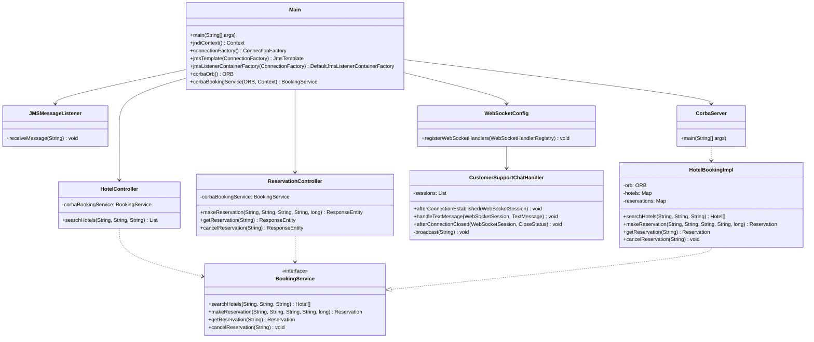

# Projec Overview
This project represents a booking system devided to 
    -serverSide
    -clientSide
used protocols
(SOA)
-REST 
-CORBA
-JNDI

(D.A.R)
-Websocket
-JMS

(BD)
easyphp

## UML Class Diagram

